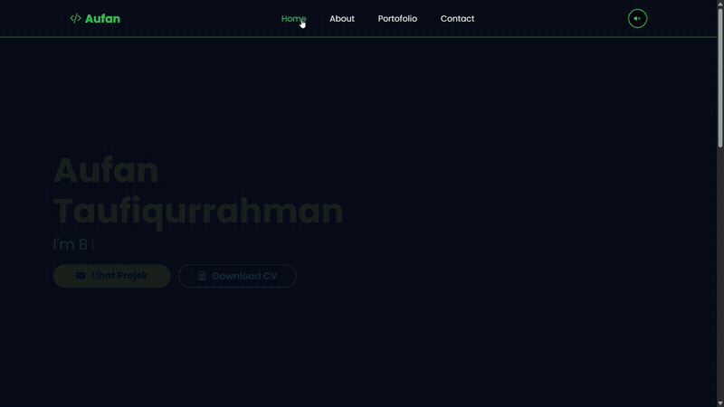

<div align="center">


<p>
  
  
  
  
  
</p>

<a href="https://aufan.ifportofolio.com">
  
</a>

<br/>


</div>

<br/>

## Informasi Project

| Entitas | Detail |
| :--- | :--- |
| **Nama** | Aufan Taufiqurrahman |
| **NIM** | 2411532011 |
| **Domain** | [aufan.ifportofolio.com](https://aufan.ifportofolio.com) |
| **Hosting** | Hostinger shared hosting (hPanel, Node.js + Passenger) |

## Deskripsi

Website pribadi dengan dua fungsi utama:

1. **Publikasi laporan praktikum** di `/blog` — ini fungsi yang paling dipakai, karena
   dosen memeriksa laporan lewat halaman ini. Laporan ditulis dari panel admin dengan
   struktur baku praktikum: tujuan, dasar teori, alat & bahan, langkah kerja, latihan &
   tugas, dan kesimpulan.
2. **Showcase project** di `/portofolio` — galeri project dengan filter kategori dan modal
   detail.

Tema *dark mode* dengan aksen hijau neon `#11cf3d`.

## Tech Stack

| Lapisan | Teknologi |
| :--- | :--- |
| Framework | Next.js 14 (App Router) + TypeScript |
| Styling | Tailwind CSS 3 |
| Animasi | Framer Motion + GSAP |
| Database | MySQL (`mysql2`) — satu server dengan aplikasi |
| Auth admin | Session cookie HMAC-SHA256, password scrypt |
| Upload gambar | Cloudinary (upload widget) |
| Deploy | GitHub Actions → branch `deploy` → webhook → Passenger restart |

> Sebelumnya backend memakai Supabase. Migrasi ke MySQL dilakukan pada 2026-09-12 karena
> project Supabase free tier dipause saat jarang diakses lalu dihapus permanen — yang
> membuat seluruh laporan praktikum hilang dari situs. Database sekarang menyatu dengan
> shared hosting sehingga tidak bisa dinonaktifkan pihak lain.

## Struktur

```
src/
├── app/
│   ├── page.tsx              # homepage (server) -> HomeView.tsx (client)
│   ├── HomeView.tsx
│   ├── blog/                 # daftar & detail laporan praktikum
│   ├── portofolio/           # galeri project
│   ├── admin/                # login + CRUD blog & project
│   ├── api/                  # auth, blogs, projects, deploy
│   └── diagnose/             # alat diagnosa database (admin-only)
├── components/
├── hooks/
├── lib/
│   ├── db.ts                 # pool MySQL
│   ├── blogs.ts projects.ts  # query (server-only)
│   ├── auth.ts session.ts    # autentikasi admin
│   ├── rows.ts validation.ts
│   └── api.ts                # fetch client untuk halaman admin
└── middleware.ts             # penjaga /admin dan /diagnose

db/schema.sql                 # skema MySQL
scripts/                      # setup DB, buat admin, import & export data
backup/                       # salinan laporan praktikum
```

## Menjalankan Secara Lokal

```bash
npm install
cp .env.example .env.local     # lalu isi DB_* dan SESSION_SECRET
npm run secret                 # bantu generate SESSION_SECRET
npm run db:setup               # buat tabel
npm run admin:create -- you@mail.com "password-yang-panjang"
npm run dev                    # http://localhost:3000
```

## Setup Database di Hostinger

Cara paling mudah di shared hosting, tanpa perlu mengaktifkan Remote MySQL:

```bash
npm run db:sql -- you@mail.com "password-yang-panjang"
```

Perintah itu menghasilkan `db/migration.sql` (skema + user admin + laporan praktikum).
Buka **hPanel → Databases → phpMyAdmin**, pilih database, tab **SQL**, tempel isinya, **Run**.

Lalu isi environment variable di **hPanel → Node.js app**: `DB_HOST=localhost`, `DB_PORT`,
`DB_USER`, `DB_PASSWORD`, `DB_NAME`, `SESSION_SECRET`, `NEXT_PUBLIC_SITE_URL`.

## Backup

Shared hosting tidak memberi backup database yang bisa diandalkan, dan data laporan pernah
hilang sekali. Jalankan berkala (bisa lewat cron job hPanel) lalu simpan hasilnya di luar
server:

```bash
npm run db:export     # -> backup/exports/blogs-YYYY-MM-DD.json
```

Hasilnya bisa dipulihkan kembali dengan `npm run db:import <file>`.
